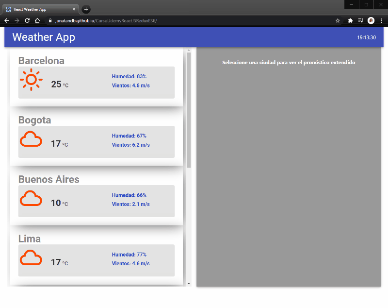

# Mis notas del curso de Udemy: React JS + Redux + ES6

## Github pages: https://jonatandb.github.io/CursoUdemyReactJSReduxES6/

Curso un Udemy: [React JS + Redux + ES6. Completo ¡De 0 a experto! (español)](https://www.udemy.com/course/react-js-redux-es6-completo-de-0-a-experto-espanol/)

Repositorio:
[https://github.com/Jonatandb/CursoUdemyReactJSReduxES6](https://github.com/Jonatandb/CursoUdemyReactJSReduxES6)


<p align="center">
    <a href="https://jonatandb.github.io/CursoUdemyReactJSReduxES6/">
        
    </a>
</p>

---

3. Node.js, Npm y Yarn

   https://nodejs.org/es/

   https://classic.yarnpkg.com/en/docs/install#windows-stable

   NodeJs permite escribir aplicaciones del lado del servidor sin bloqueo de entradas/salidas, lo que lo hace muy eficiente.

4) Gestor de Paquetes NPM y Yarn

   https://www.npmjs.com/

   https://yarnpkg.com/

5. VSCode

   https://code.visualstudio.com/download

6) Puntos fuertes de React JS

   https://reactjs.org/


    Posee un gran ecosistema (hay muchas entensiones y recursos relacionados disponibles que extienden sus características)

    Estabilidad y alta retrocompatibilidad
    	La forma en que los creadores de React manejan las versiones y la manera en que van haciendo evloucionar la librería permite que
    		no existan quiebres de compatibilidad entre versiones y que se logre mayor estabilidad general de la plataforma.

    Performance
    	Se logra mediante una librería muy liviana que provee tiempos de carga muy buenos y también posee una buena velocidad de
    		actualización de pantalla, obtenida por renderizaciones parciales inteligentes mediante su virtual dom y el proceso
    		denominado reconciliation.

    A nivel de arquitectura React representa la V de vista del modelo MVC, y suele utilizarse dentro de SPA's (single page applications)

7.  ¡Hola Mundo! Babel, ES6, CodePen

    ¿Que es JSX?
    https://facebook.github.io/jsx/
    https://medium.com/@Thoughtworks_es/qu%C3%A9-demonios-es-jsx-txt-f5841e51f664

        Fundamentalmente, solo es azúcar sintáctico para la función de React:
        React.createElement(component, props, ...children)
        (por eso necesitamos tener a React dentro del scope del proyecto)

        Fue creado con la intención de que los preprocesadores (ej. Babel.js) lo transformen en ECMAScript estándar.
        Es decir, el gran propósito de JSX es el de proveer una sintaxis –familiar y concisa (tipo HTML/XML)– para
        	definir estructuras de nodos con propiedades y atributos.
        Existen un par de “reglas” para utilizar JSX:
        	Escribir nuestros propios componentes con capitalización. <App />
        	Escribir los componentes built-in (HTML) con minúsculas. 
        JSX no es ni HTML, ni XML; solo se asemeja para ayudar a la legibilidad –para parecer más familiar.
        	Es un simple patrón de composición de funciones pero con una sintaxis similar al HTML/XML.
        En realidad, la mayor diferencia –visual– entre JSX y HTML, es el tener que usar className para agregar una clase,
        	ya que class es una palabra reservada en JS.

    Babel
    https://babeljs.io/

        Babel es un preprocesador de Javascript que entiende versiones de Javascript modernas (como ES6) y las convierte a
        	una versión compatible con la mayoría de los navegadores.

    Herramienta que ejecuta Babel online:
    http://traductor-babel.surge.sh/
    Permite que se ingrese JSX y muestra el javascript necesario para crearlo utilizando javascript clásico.
    Ej: <Dropdown sarasa="Jony"><Menu><MenuItem>lala</MenuItem></Menu></Dropdown>

    CodePen "Hola mundo" en React:
    https://codepen.io/correooke/pen/vzwPqX

        Un CodePen es un proyecto online, editable, que permite realizar pruebas de concepto (o incluso proyectos completos) y
        	compartirlos muy fácilmente con quien se desee.

        Configuración básica para utilizar con React:
        	Desde las opciones de configuración del CodePen elegir:
        		JavaScript Preprocessor:	Babel
        		Add External Scripts/Pens:
        				https://cdnjs.cloudflare.com/ajax/libs/react/16.4.2/umd/react.production.min.js
        				https://cdnjs.cloudflare.com/ajax/libs/react-dom/16.4.2/umd/react-dom.production.min.js

8) Creación de app react

   Instalación de paquetes de NPM de manera "global":
   https://docs.npmjs.com/getting-started/installing-npm-packages-globally

   Instalación de Yarn:
   https://yarnpkg.com/en/docs/install

   Utilización de npx para crear una nueva aplicación: Weather App
   npx create-react-app weather-app \* Cuando quise ejecutar npx create-react-app me pasaba lo mismo que cuando ejecutaba
   create-react-app weather-app, que me apareceía un mensaje que decía que estaba usando una versión vieja de create-react-app.
   Descubrí que estaba instalado create-react-app no solo en la carpeta node_modules global de npm, sino que también en la
   carpeta de instalación de nodeJS.
   Al eliminarlo de todos lados pude ejecutar sin problemas: npx create-react-app weather-app y se creó correctamente una
   nueva aplicación de React.

   Create React App
   Es una herramienta que facilita crear de una forma fácil una SPA (Single page application) con todas las mejores recomendaciones
   de Facebook, sponsor principal de React.
   Esta app tendrá las mejores prácticas incluídas, la configuración correcta de Babel, y la configuración correcta de WebPack
   (herramienta que toma los distintos archivos de nuestra app y genera lo que se llama un bundle, un paquete con la aplicación
   listo para ejecutarse.)
   También viene configurado algo llamado "Hot reload", que es una funcionalidad que recarga nuestra página automáticamente cuando
   detecta que el código fuente de la misma es modificado. Esto permite ver casi en tiempo real el resultado de las modificaciones
   que hagamos a nuestra aplicación.

   Primera ejecución de nuestra aplicación:
   Entrar a la carpeta que se acaba de crear:
   cd weather-app
   yarn start // Se puede ejecutar también npm start.
   Con esto se abrirá una ventana del navegador con la aplicación funcionando.

   Estructura de carpetas:
   Create-react-app dentro de la carpeta de la aplicación creó las siguientes carpetas: - public
   Carpeta que posee nuestro archivo princial, index.html, el cual posee un nodo con id "root", que es donde se inyectará nuestra
   aplicación creada con React. - src
   Carpeta que contiene todos nuestros componentes, incluído el archivo principal index.js que importa y utiliza el primer componente
   generado de ejemplo llamado App.

9. Planificación con Wireframes

   Presentación de la aplicación a desarrollar durante el curso y sus distintas partes y funcionalidades.

   Herramienta para creación de Wireframes (Bosquejos):
   https://balsamiq.com/

10) Creación de functional component

    Análisis del archivo "src/App.js", el punto de entrada de la aplicación, el primer componente que "index.js" renderiza.

    Creación de una carpeta para almacenar los componentes: "src/components"

    Simpre que se utiliza JSX para crear un componente, primero se debe importar React (que es quien permite su utilización):
    import React from 'react'

    Creación del primer componente funcional: "components/WeatherLocation.js"
    const WeatherLocation = () => {
    <div>Weather Location</div>
    }

    Para que el componente creado pueda ser consumido desde otras partes de la aplicación, el mismo debe ser exportado desde el archivo donde
    está definido, esto se hace con:
    export default WeatherLocation

    Importación y uso del componente WeatherLocation desde "src/App.js":
    import WeatherLocation from './components/WeatherLocation'
    // ES6 asume que el archivo importado tiene la extensión ".js" por eso
    // se puede omitir la misma (no es necesario poner "WeatherLocation.js")
    function App() {
    return (
    <div className="App">
    <WeatherLocation /> // Uso del componente creado.
    </div>
    );
    }
    export default App;

11. VSCode Plugins y extensiones

    Plugins que hacen VSCode más interesante y útil:
    vscode-icons
    Reactjs code snippets

12) ES6 Arrow Functions

    Explicación y ejemplos de funciones flecha.

    - Son el nuevo standard que provee ECMAScript (la especificación de Javascript)
    - Son anónimas: () => { }
      En caso de necesitar referenciarlas se deben guardar su referencia en una variable:
      const miFuncion = () => {}
    - No pueden ser utilizadas como constructores.
    - Cuando posee una sola línea no es necesario que tengan la palabra return.
    - Si tiene un solo parámetro, el mismo no necesita ser envuelto en paréntesis
      Si tiene cero más de un parámentro, entonces si deben ir los paréntesis.

13. Ejercicio: Creación de componentes e importación

    Creación de componentes:
    "/components/Location.js"
    "/components/WeatherData.js"

14) Componentes WeatherExtraInfo y WeatherTemperature

15. Uso de parámetros / Herramientas de debugging

    Para pasarle parámetros a un componente, se deben agregar al mismo, en la invocación, atributos con valores.
    Éstos atributos, serán pasados por React al componente y dentro de los mimsos estará el valor asígnado a cada uno en la invocación
    al componente.
    Métodos de debugging:
    Pablabra clave: debugger;
    Cuando esta sentencia se deja en el código la misma funciona como un breakpoint, por lo tanto la ejecución de este programa se
    pausará al llegar a esta línea, pero para que eso suceda se debe debuggear la aplicación.

    Uso de Chrome para debugging:
    En nuestro sitio web presionamos F12 y se abrirá el panel de herramientas de desarrollador de Chrome, en este panel ir a la solapa
    denominada "Sources" y recargar la página. Al recargarse la página se vuelve a ejecutar nuestro programa y al llegar la
    ejecución a la línea con la sentencia "debugger" la misma se detendrá en ese punto, permitiendonos inspeccionar el estado y
    contenido de las distintas variables y objetos de nuestra aplicación en ese momento.
    En caso de necesitar puntos de interrupción adicionales, no es necesario modificar el código, sino que se pueden establecer
    haciendo click en cualquier número de línea de la banda numerada a la izquierda del código en el panel de código de la
    solapa "Sources", una vez creado un punto cada vez que la ejecución pase por ahí se pausará como con la instrucción
    "debugger".

16) Parámetro con Object Destructuring

    https://developer.mozilla.org/es/docs/Web/JavaScript/Referencia/Operadores/Destructuring_assignment

    Destructuring es una técnica que es parte de ECMAScript 6 que establece que cuando tenemos una propiedad con un nombre que luego
    queremos asignar a una variable/constante con el mismo nombre que lo propiedad, la podemos asignar de forma directa con esta
    técnica:

        Sin Destructuring:
        	const MiComponente = (props) => {
        		const city = props.city;

        Con Destructuring:
        	const MiComponente = (props) => {
        		const { city } = props;

        Si el objeto props tuviera más propiedades que quisiera asignar a constantes, se pueden obtener así:
        	const MiComponente = (props) => {
        		const { city, address } = props;

        Simplificando más el código utilizando Destructuring:
        	const MiComponente = ({ city }) => {
        		const city = city;

17. ES6: Object Destructuring

    const obj = { name: 'Jonatandb', nick: 'Jony' };
    const { name: myName, nick: myNick } = obj; // Extraigo de obj los valores de name y nick pero lo asigno a nuevas constantes de nombre myName y myNick
    console.log(myName); // Jonatandb
    console.log(myNick); // Jony

    Otro caso:
    const { name, nick } = obj; // Cuando extraigo los valores de las propiedades de un objeto y las asigno a variables del mismo nombre, puedo omitir
    // la declaración de las variables con el mismo nombre.
    // Sintaxis no resumida:
    // const name = obj.name;
    // const nick = obj.nick;

    Destructuring de arrays:
    const [x, y] = [1,2];
    console.log(x); //-> 1

    Destructuring con valores por defecto:
    const { x, y = 1 } = {}
    console.log(x); // undefined
    console.log(y); // -> 1

    Destructuring de arrays con "elision" (lo que permite omitir una o más posiciones de un array):
    const [ , , x, y] = ['a', 'b', 'c', 'd']
    console.log(x); // -> 'c'
    console.log(y); // -> 'd'

    Destructuring en conjunto con uso del rest operator (...):
    Se utiliza para meter en un objeto el resto de valores que queden luego de extraer los deseados.
    El rest operator se identifica con tres puntos igual que el spread operator, pero su función es diferente.
    const [x, ...y] = ['a', 'b', 'c', 'd'];
    console.log(x); // -> 'a'
    console.log(y); // -> ['b', 'c', 'd']

18) Parámetros y uso de template string

    Template string:
    Se tratan de cadenas de texto especiales, porque van entre tildes invertidos `texto de la cadena` y tiene la particularidad de que pueden
    contenter variables, pero para que se muestre como parte del string el contenido de la variable, a la misma se la debe encerrar entre
    el signo de pesos y llaves: \${variable}
    Ej:
    const nombre = "Jonatandb";
    console.log(`Este texto fue mostrado por ${nombre}.`); // -> Este texto fue mostrado por Jonatandb.

19. ES6: Template Strings

    También se conocen como template literals.

20) Instalación de libreria con npm install o yarn add

    Instalación de componente para mostrar íconos del clima: React-WeatherIcons

    ## Weather Icons:

        Weather Icons sitio oficial:
        	http://erikflowers.github.io/weather-icons/

        React Weather Icons:
        	https://www.npmjs.com/package/react-weathericons

        	Instalación:
        		npm install react-weathericons

        		Requiere que se agrege también a "index.html" una referencia a un archivo de estilos específico:
        			Weather Icons CDN:
        				https://cdnjs.com/libraries/weather-icons

        				Agregar a index.html:
        					<link rel="stylesheet" href="https://cdnjs.cloudflare.com/ajax/libs/weather-icons/2.0.9/css/weather-icons.min.css" />

    Uso de Yarn para instalar paquetes:
    yarn add react-weathericons
    \*\* Instala como npm el paquete indicado y actualiza el package.json, solo que funciona mejor que npm al obtener los datos de forma más optimizada.

    Explicación general de la página de NPM.

    Explicación de características generales de GitHub.

21. Recomendaciones sobre uso de packages externos y ubicación del index.html

    React Weather Icons requiere que se agrege también a "index.html" una referencia a un archivo de estilos específico:
    Agregado a "public/index.html":
    <link rel="stylesheet" href="https://cdnjs.cloudflare.com/ajax/libs/weather-icons/2.0.9/css/weather-icons.min.css" />

    Weather Icons sitio oficial, para consultar el total de íconos disponibles:
    http://erikflowers.github.io/weather-icons/

    CDN:
    Content delivery network, serie de servidores con recursos comunmente muy utilizados por muchos sitios webs, que pueden ser consumidos directamente
    permitiendo que no necesitemos tener tales recursos en nuestro servidor o en la pc del cliente sino que se descargan en el momento.

22) Agregar Icono y uso de función en functional component

23. Utilización de constantes

24) PropTypes

    Ayuda a validar las propiedades que se le pasan a un componente componente.

    Instalación:
    yarn add prop-types

    Uso:
    import PropTypes from 'prop-types'

        Antes de la linea export defual nombreComponente, se escribe la validación por ej. asi:
        	nombreComponente.propTypes = {
        		propiedad1: PropTypes.number,
        		propiedad2: PropTypes.string,
        	}
        A partir de este momento, si cuando se utiliza este componente, se le pasa un tipo de dato diferente al especficado en sus propiedades,
        aparecerá una advertencia en consola indicando tal diferencia.

        Lo mismo sucede si a alguna propiedad además de configurarsele su tipo de dato, se le especifica que es requerida, por ej. asi:
        	nombreComponente.propTypes = {
        		propiedad1: PropTypes.number.isRequired,
        		propiedad2: PropTypes.string,
        	}
        En este caso, si se intenta utilizar el componente sin pasarle un valor a su propiedad "propiedad1", también aparecerá una advertencia
        en la consola indicado la falta de un valor para esa propiedad.

25. Validación con PropTypes

    Instalación de extensión "React code snippets" que posee abreviaciones útiles para trabajar con React.
    Por ej, al escribir ptsr y presionar TAB, se auto-escribe: propTypes.string.isRequired
    Con esto se pueden especificar los tipos de las propiedades de los componentes de una forma más rápida.
    También se puede utilizar:
    pta propTypes.Array
    ptnr propTypes.number.isRequired
    y muchas abreviaciones más... (leer documentación de la extensión).

    Agregado de validaciones con PropTypes a todos los componentes del proyecto.

26) Repaso sobre validaciones de PropTypes

    Validaciones disponibles: (A todas se les puede agregar al final ".isRequired")

        PropTypes.array
        PropTypes.bool
        PropTypes.func
        PropTypes.number
        PropTypes.object
        PropTypes.string
        PropTypes.symbol
        PropTypes.element	Un elemento React
        PropTypes.node 		Cualquier cosa que pueda ser renderizada: numeros, strings, elementos o fragmentos de éstos tipos.
        					Es como una categoría más que PropTypes.element
        PropTypes.instanceOf(Message)	Permite validar que se está pasando una instancia de un objeto específico.
        PropTypes.oneOf(['News', 'Message', etc.])	Permite validar que el tipo sea de alguno de la lista especificada.
        PropTypes.oneOfType([ PropTypes.array, PropTypes.number, PropTypes.instanceOf(Message)]		Similar al anterior.
        PropTypes.arrayOf(PropTypes.number)		Similar al anterior, pero se aclara que se recibirá un array de un tipo especificado.
        PropTypes.shape({
        	color: PropTypes.string,
        	fontSize: PropTypes.number
        })								Permite validar que el valor recibido sea un objeto que tenga las propiedades especificadas.
        PropTypes.any		Permite cualquier tipo de valor.

27. Truco para refactorizar sin problemas: Uso de carpetas e Index.js

    Reorganización de carpetas y renombrado de archivos.

    Aprovechando que cuando se hace import sin especificar la extensión del archivo importado, se busca por defecto tanto un archivo
    con el nombre especificado (y extensión .js) como una carpeta con dicho nombre (que dentro tenga un archivo index.js), se
    renombran los archivos para dejar por cada componente una carpeta con el nombre del mismo y dentro un archivo index.js con el
    componente.
    Con este refactor se puede pasar de tener una estructura así:
    /components - Location.js - WeatherData.js - WeatherExtraInfo.js - WeatherLocation.js - WeatherTemperature.js
    a esta estructura:
    /components
    /WeatherLocation - index.js Ex WeatherLocation.js - Location.js
    /WeatherData - index.js Ex WeatherData.js - WeatherExtraInfo.js - WeatherTemperature.js

28) Cómo incluir CSS en React

    Agregado de un archivo "styles.css" dentro de cada carpeta de cada componente para especificar sus estilos.

    Agregado de clases a los divs contendores de los componentes.

    Para agregar clases a los componentes, en los divs contendores se debe utilizar "className" en lugar de "class".

29. Opciones para estilo: CSS, Preprocesadores CSS y CSSModules

    CSS describe cómo se va a ver cada elemento de la página.

    SASS, LESS, son preprocesadores de CSS que extienden las capacidades de CSS agregando variables, reglas anidadas, mixing, importación
    de archivos y mucho más. Ayudan a mantener grandes hojas de estilo bien organizadas.

    "CSS Modules" es un módulo utilizado dentro del mundo de React que tiene una diferencia con respecto al uso de un archivo "styles.css"
    ya que utiliza un alias para el mismo.

30) CSS en React "Under the hood"

    WebPack cuando comprime el contenido de nuestra aplicación, mete tanto el javascript como el css, todo junto, en un archivo llamado "bundle.js"
    Este archivo en desarrollo es legible, pero en productivo está minificado para reducir el tamaño al máximo para que descargue enseguida
    del servidor y la aplicación esté disponible lo más rápido posible en el navegador del usuario.

31. Aplicación de estilos CSS

32) Estilos componente WeatherTemperature

33. Estilos componente WeatherExtraInfo

34) External Font y otros detalles

    Agregado de una fuente externa desde la página de fuentes de Google: fonts.google.com
    Desde la página de la fuente "Roboto":
    https://fonts.google.com/specimen/Roboto
    hacer click en "SELECT THIS FONT" para que aparezca el código HTML necesario para utilizar esta fuente
    en nuestra aplicación.
    Ir al archivo "index.html" y en el Head pegar el código obtenido:
    <link href="https://fonts.googleapis.com/css?family=Roboto&display=swap" rel="stylesheet">
    Luego, desde cualquier archivo css, se puede hacer uso de la fuente mediante:
    font-family: 'Roboto', sans-serif;

35. Herramientas de debugging para estilo y CSSMatic

    Uso de las herramientas de desarrollador de Chrome para inspeccionar los elementos HTML y sus estilos aplicados y manipularlos para revisar ajustes.

    CSSMatic.com
    Está pagina contiene herramientas online que podemos utilizar en nuestras hojas de estilo.
    Posee un generador de gradientes, el cual manipulamos en linea y luego copiamos el código generado para utilizarlo en nuestra aplicación.
    Posee también un generador de sombras, otro de bordes, otro de texturas...

    CSS-Tricks.com
    Tutoriales de calidad para aprender a trabajar con Flexbox, CSS Grid, entre otros.

36) Doble Destructuring

    Se utiliza cuando se desea extraer de un objeto con varios niveles de propiedades, algunos de sus valores.
    Por ej, teniendo el siguiente obtejo:
    const miObjeto = {
    propiedad1: 123,
    data: {
    propiedada: 'a',
    propiedadb: 'b'
    }
    }
    Se puede hacer doble destructuring y extraer solo los valores de las propiedades de la propiedad data:
    const { data: { propiedada, propiedadb } } = miObjeto;
    A partir de este momento, tengo disponibles mediante las constantes propiedada y propiedadb, los valores 'a' y 'b' respectivamente.

37. Utilización de PropType.Shape

    Se utiliza para especificar que una propiedad de un componente va a recibir un objeto con una forma específica y con propiedades con valores
    de los tipos especificados:
    WeatherData.propTypes = {
    data: PropTypes.shape({
    temperature: PropTypes.number.isRequired,
    weatherState: PropTypes.string.isRequired,
    humidity: PropTypes.number.isRequired,
    wind: PropTypes.string.isRequired,
    }),
    }
    En este caso se utilza para declarar que el componente WeatherData tiene una propiedad llamada 'data' que recibe como valor un objeto
    el cual tiene las propiedades 'temperature', 'weatherState', 'humidity' y 'wind', con los tipos de datos específicados.

38) Cómo transformar un functional en un class Component
    Se debe modificar el componente funcional, por ej:
    const MiComponente = () => {
    return (
    <div>
    <span>Este es mi componente</span>
    </div>
    )
    }
    De la siguiente manera:
    import React, { Component } from 'react';
    class MiComponente extends Component {
    render() {
    return (
    <div>
    <span>Este es mi componente</span>
    </div>
    );
    }
    }

39. Evento OnClick y manejo de State
    Para poder tener estado en un componente, el mismo debe ser un componente de clase.
    Además, el componente de clase, debe tener definido el método constructor(), y el mismo por dentro debe llamar al constructor de su clase padre:
    constructor() {
    super()
    }
    Una vez hecho esto, se puede establecer el estado inicial del componente, ej:
    class MiComponente extensión Component {
    constructor() {
    super();
    this.state = {
    mensaje: 'Estado inicial del componente',
    }
    }
    }
    Luego, mediante interacciones del usuario con el componente, por ejemplo haciendo click, se puede alterar este estado,
    lo que hará que el componente se renderice, dibujandose de nuevo y por ende mostrando el nuevo estado:
    class MiComponente extensión Component {
    constructor() {
    super();
    this.state = {
    mensaje: 'Estado inicial del componente',
    }
    }
    handleClick = () => {
    console.log('Se clickeó el div');
    this.setState({
    mensaje: 'Este mensaje aparece como resultado de modificar el state'
    })
    }
    render() {
    const mensaje = this.state;
    return (
    <div onClick={this.handleClick}>
    <span>Mensaje a mostrar: {mensaje}</span>
    </div>
    );
    }
    }
    Es muy importante tener en cuenta que para modificar el state de un componente, no se puede llamar a this.state y asignarle un nuevo valor, como
    se hace durante la inicialización en el constructor, ya que arrojará un error por la consola y no surtirá efecto. Lo que se debe hacer en su
    lugar es utilizar la funcionalidad this.setState(), la cual recibe como valor un objeto con la propiedad que se desea agregar o actualizar al
    state del componente.

40) SetState (updater)

    Explicación de lo que sucede al setear el estado inicial y al actualizarlo utilizando mediante el uso de this.setState({})

41. React Developer Tools para Chrome

    Instalación de extensión para Chrome que facilita el debugging de aplicaciones React:

        React Developer Tools
        https://chrome.google.com/webstore/detail/react-developer-tools/fmkadmapgofadopljbjfkapdkoienihi?hl=es

    Esta extensión agregar a las herramientas de desarrollador de Chrome, un par de solapas que permite inspeccionar los componentes que
    componen nuestra aplicación.
    Permite buscar componentes por nombre, clickear los componentes de la página para mostrar sus propiedades y los valores de la misma.
    Permite que sean modificadas las propiedades para ver en tiempo real los resultados.
    Permite activar la opción "Highlight Updates", lo que muestra un borde resaltado en los componentes cuando los mismos se actualizan.
    Permite también revelar dentro de que componente se encuentra un elemento HTML al que le hicimos click luego de seleccionar "Inspeccionar
    elemento".

42) Api Rest OpenWeatherMap

    Explicación de funcionamiento del servicio de OpenWeatherMap.

    ## OpenWeatherMap: Servicio gratuito que provee datos del clima

        Página principal:
        				https://openweathermap.org/

        Documentación de la API:
        				https://openweathermap.org/api

        Guía de uso - How to start:
        				https://openweathermap.org/appid

        "Ciudad Autónoma de Buenos Aires", "id": 3433955,

43. Fetch y solapa de debugging Network de Chrome

    fetch es una función incluída en el core de JavaScript que realiza peticiones http.

    fetch al ser relativamente nueva, no es totalmente compatible con navegadores antiguos, por lo que se recomienda en todo caso utilizar: Axios.

    Explicación y uso de la solapa Network de las herramientas de desarrollador de Chrome.

44) Promises

    Una promise se utiliza para procesamientos asincronicos
    Su resultado puede ser obtenido ahora, en un futuro o nunca.
    Estados:
    Pendiente
    Cumplida
    Rechazada

    Ciclo de vida de una promise:
    Inicialmente se encuentra en estado Pending
    Cuando se ejecuta puede pasar al estado Fulfill (Cumplida) o al estado Rejected (Rechazada).
    Si termina en estado Fulfill se ejecuta entonces la funcionalidad dentro de la llamada a ".then()", then() recibe como parámetro el resultado
    de la ejecución de la promise y se puede hacer en ese momento lo que se necesite, incluso hacer una nueva llamada a otra Promise por ejemplo.
    En caso de terminar Rejected, se va a ejecutar la funcionalidad dentro de ".catch()", si hubiera uno.
    Las promises se pueden encadenar.

    Ej:
    let promesa = new Promise( (resolve, rejected) => {
    setTimeout( () => {
    resolve("Éxito"); // Esta promesa al ser ejecutada se resolverá exitosamente devolviendo el string "Éxito".
    }, 2000); // La promesa tardará 2 segundos en resolverse exitosamente.
    })
    console.log("Ejecución de la promise...");
    promesa.then( msg => {
    console.log("Mensaje devuelto por la promesa: ", msg);
    })
    console.log("Fin de la ejecución de la promise.");

        El resultado por consola de esta ejecución es el siguiente:
        	Ejecución de la promise...
        	Fin de la ejecución de la promise.
        	Mensaje devuelto por la promesa: Éxito
        * Esto es así porque la promise se demoró un tiempo en ejecutarse.
        	Si se desea que la ejecución resulte en órden, se debería incluír el último console.log() dentro de la función pasada a .then(), de esta manera
        		solo se verá el mensaje de fin cuando la promesa se ejecute correctamente, ej:
        		let promesa = new Promise( (resolve, rejected) => {
        			setTimeout( () => {
        				resolve("Éxito");		// Esta promesa al ser ejecutada se resolverá exitosamente devolviendo el string "Éxito".
        			}, 2000);					// La promesa tardará 2 segundos en resolverse.
        		})
        		console.log("Ejecución de la promise...");
        		promesa.then( msg => {
        			console.log("Mensaje devuelto por la promesa: ", msg);
        			console.log("Fin de la ejecución de la promise.");
        		})

        En caso de querer contemplar el caso en el que la promesa por alguna razón falla durante su ejecución, se debe agregar la llamada a .cacth() y
        	pasarle la funcionalidad a ejecutarse en tal caso, ej:

        	let promesa = new Promise( (resolve, rejected) => {
        		setTimeout( () => {
        			rejected("La promesa falló!");		// Esta promesa al ser ejecutada se resolverá como Rechazada.
        		}, 2000);								// La promesa tardará 2 segundos en resolverse.
        	})
        	console.log("Ejecución de la promise...");
        	promesa.then( msg => {
        		console.log("Mensaje devuelto por la promesa: ", msg);
        	}).catch( err => {
        		console.log("Este mensaje se mostrará cuando la ejecución falle:", err);
        	})
        	console.log("Fin de la ejecución de la promise.");
        El resultado por consola de esta ejecución es el siguiente:
        	Ejecución de la promise...
        	Fin de la ejecución de la promise.
        	Este mensaje se mostrará cuando la ejecución falle: La promesa falló!

45. Utilización de valores retorno de Fetch

    https://developer.mozilla.org/es/docs/Web/API/Fetch_API/Utilizando_Fetch
    https://developer.mozilla.org/es/docs/Web/API/Body

    fetch es un método global de Javascript que devuelve una Promise, pero esa promise todavía no tiene el resultado que se espera.
    fetch toma como parámetro la url a la que se desea hacer la solicitud, este parámetro es obligatorio.
    fetch devuelve entonces una Promise que finalmente se resuelve a un objeto Response, de ese response de puede consultar su objeto
    body (https://developer.mozilla.org/es/docs/Web/API/Body) y ejecutar métodos que él mismo provee para convertir la respuesta
    obtenida en algo que nos resulte útil, por ejemplo ".json()".
    .json() es un método que se ejecuta sobre el objeto Response y luego de leerlo hasta el final devuelve una Promise que se
    resuelve con el resultado de parsear todo el contenido del body a JSON.

46) Transformación de datos

    Análisis del json obtenido desde el servidor para planificar como extraer desde el mismo la información relevante que el
    componente que muestra los datos del clima necesita para funcionar correctamente.

47. Arquitectura de datos: independencia de API

    En este punto se desarrolla una función que obtiene como parámentro la respuesta desde el servidor y devuelve un objeto cuyo contenido
    es precisamente lo que el componente WeatherLocation necesita para mostrarse correctamente.

    Esto permite tener una interfaz de usuario independiente de la tecnología subyacente en el servidor al que se le solicitan los datos,
    permitiendo por ejemplo que si algún día se cambia de servidor del clima, tocando solamente esa funcionalidad se pueda seguir
    haciendo que el componente reciba los datos correctos (configurando nuevamente el mapeo hecho ahí dentro).

48) Object Literal Property Value Shorthand

    https://developer.mozilla.org/es/docs/Web/JavaScript/Reference/Operators/Object_initializer

49. Convert-Units

    Una opción de hacer que la temperatura se vea en grados centígrados, es agregar a la url del servidor al que se piden los datos, el siguiente
    parámetro:
    &units=metric
    por lo que quedaría así:
    const api_weather = `${url_base_weather}?q=${location}&appid=${api_key}&units=metric`;
    y todos los valores se obtendrán en grados centígrados.

    Otra opción es usar por ejemplo la librería 'convert-units', lo que permite desarrollar una funcionalidad que le permita al usuario elegir en
    todo momento en que notación desea ver los valores de las temperaturas.

        Instalación:
        	npm install convert-units

        Uso:
        	import convert from 'convert-units';
        	getCelsius = kelvin =>		// Creo un método que recibe un valor en kelvin
        		Number(					// y lo devuelve convertido en Celsius, con sólo dos decimales.
        		convert(kelvin)
        			.from("K")
        			.to("C")
        			.toFixed(2)
        		);

50) Services Layer

    SOLID:
    -> S: Single responsability

        	Quiere decir que cada una de las clases tienen que tener una única responsabilidad para poder tener el menor nivel de acoplamiento,
        		lo que permite que luego se modifique lo más rápido posible cuando se necesite hacerlo, sin que esto afecte a otras clases.

        	Teniendo en cuenta esto, se hace incapié en que la clase WeatherLocation posee métodos que hacen transfomaciones de los datos (getData,
        		getTemp, getWeatherState...) y esto está mal porque se está acoplando la vista con tales funciones de transformación.
        		Esto es mejor sacarlo de esta clase y hacer lo que se llama una "capa de servicios" que exponga estas funcionalidades, para de paso
        			reutilizarlas desde otro lado si fuese necesario.
        		Para esto, se crea una carpeta en el raíz llamada "services" con el archivo "transformWeather.js"
        			Este archivo contendrá una constante con cada uno de los métodos de la clase (se quitán por lo tanto de la clase) y se cambia
        			el nombre del método getWeatherState a transformWeather y se lo exporta con export default transformWeather;
        			En la clase, importa este archivo y se en el click del botón ahora se llama a esta función en lugar de a this.getWeatherState().

        	También se transladan las constantes utilizadas para formar la url del servicio del clima al archivo "constants/api_url.js" y se importa
        		la constante api_weather que es la única que utilizará el WeatherLocation.

51. React Class Component LifeCycle

    Eventos del ciclo de vida de los componentes de clase de React

    Los eventos que se ejecutan son los siguientes:
    constructor
    componentWillMount
    componentDidMount
    componentWillUpdate
    componentDidUpdate
    render

    El orden en el que se ejecutan, la primera vez que se carga el componente, es el siguiente:

        constructor
        componentWillMount			UNSAFE		Se va a discontinuar, se debería usar componentDidMount	**
        render
        componentDidMount			** Este es el lugar correcto donde se deberían hacer solicitudes al servidor.

    Cada vez que se actualiza el componente, se ejecutan los siguientes:

        componentWillUpdate			UNSAFE		Se va a discontinuar, se debería usar componentDidUpdate **
        render
        componentDidUpdate

52) ComponentDidMount y Network Slow 3G Chrome Tool

    Teniendo en cuenta de que no se puede utilizar el método componentWillMount() porque será discontinuado, se debe tener en cuenta
    de que siempre sucederá que la primera vez que el componente se renderice y muestre lo hará sin datos del servidor, por lo que hay
    que preparar el componente para que muestre datos que den a entender al usuario de que el componente aún se está cargando y no
    posee la información final.
    Luego de prepararlo con un estado incial, se debe agregar la funcionalidad que obtiene los datos reales en el método componentDidMount()
    Por lo que el componente se renderizará incialmente dos veces, una en la carga incial y otra en la actualización cuando se obtengan los
    datos del servidor.

53. Indicador de Carga, utilización ternario

    Uso del operador ternario

54) Material Design

    Explicación general sobre Material Design
    https://material.io/

55. Material UI

    https://material-ui.com/es/

    Componentes de React para un desarrollo web más rápido y sencillo.

    Instalación: https://material-ui.com/es/getting-started/installation/
    npm install @material-ui/core

    Los componentes de Material-UI funcionan sin ninguna configuración adicional,
    y no ensucian el global scope:
    import React from 'react';
    import { Button } from '@material-ui/core';

        	function App() {
        		return <Button color="primary">Hello World</Button>;
        	}

    peerDependencies - https://classic.yarnpkg.com/es-ES/docs/dependency-types/
    Las dependencias en pares son un tipo especial de dependencia que solo se necesitan si estás publicando tu paquete.
    Al tener una dependencia en par, significa que tu paquete necesita una dependencia que es exactamente la misma
    dependencia que la persona que instala tu paquete. Esto es útil para paquetes como react que necesita tener
    una única copia de react-dom que también es usada por la persona que instala tu paquete.

    Material-UI fue diseñado con la fuente Roboto en mente.
    Así que asegúrate de seguir estas instrucciones:
    https://material-ui.com/es/components/typography/#general
    The Roboto font will not be automatically loaded by Material-UI.
    The developer is responsible for loading all fonts used in their application.
    Roboto Font has a few easy ways to get started. For more advanced configuration,
    check out the theme customization section: https://material-ui.com/es/customization/typography/
    Puedes referenciarla, por ejemplo, a través de Google Web Fonts:
    <link rel="stylesheet" href="https://fonts.googleapis.com/css?family=Roboto:300,400,500,700&display=swap" />

56) Instalación y uso de MaterialUI

    Instalación:
    yarn add @material-ui/core

    Agregado de la fuente Roboto a public/index.html:
    <link rel="stylesheet" href="https://fonts.googleapis.com/css?family=Roboto:300,400,500,700&display=swap" />

    Agregado del meta viewport requerido para que todo lo relacionado con Material-UI se vea bien en celulares:
    <meta name="viewport" content="width=device-width, initial-scale=1, shrink-to-fit=no" />

57. Utilización y configuración de ESLint

    http://eslint.org

    Un Linter permite un cheque estático del código.<br/>
    Eslint se busca e instala como extensión de VSCode, la versión actual es la 2.1.2<br/>
    Puede facilitar la utilización normas de estilo (uso de mayúsculas, minúsculas al escribir el código, el uso de espacios o tabs, comillas simples o dobles, lineas con o sin punto y coma al final, etc.)<br/>
    Las aplicaciones creadas con Create-React-App ya posee una configuración establecida por defecto en el archivo package.json, la misma se escuentra en la sección "eslintConfig":
    ```json
    "eslintConfig": {
        "extends": "react-app"
    },
    ```
    "react-app" hace referencia a un conjunto de reglas preestablecidas y conocidas por Eslint y al instalar la
    extensión para VSCode las mismas comienzan a ser verificadas a medida que escribimos código.

    Como VSCode tiraba un error en la ventana de Salida que decía que no podía ejecutar Eslint, lo investigué y solucioné creando el archivo ".vscode/settings.json", según indican en esta página:<br/>
        https://github.com/vuejs/eslint-plugin-vue/issues/976#issuecomment-560294624<br/>
    en el archivo establecí la ruta a la carpeta con mi código js:
    ```json
    {
        "eslint.workingDirectories": ["./weather-app/src"]
    }
    ```
    Luego inicialicé eslint en el directorio de trabajo ejecutando lo siguiente:<br/>
    ```
    .\node_modules\.bin\eslint --init
    ```
    Esto me pidió que elija que configuraciones deseaba utilizar y luego de instalar paquetes extra necesarios, creó el archivo ".eslintrc.json" y comenzó a marcar correctamente en la ventana de "Problemas" los errores detectados en el código.<br/>
    Como no dejaba de marcarme como error en las funciones arrow (en el signo =), lo investigué y encontré que la solución era agregar esto:
    ```json
    "parser": "babel-eslint",
    ```
    https://grantnorwood.com/eslint-parsing-error-unexpected-token-visual-studio-code/

58) Uso de propiedades en Class Component combinado con state

59. LocationList

    Creación de componente que tiene una lista de componentes WeatherLocation

60) Mapeo de estados a íconos

    Refactor para utilizar correctamente el dato al respecto del estado del clima
    en cada ciudad y mostrar el ícono correspondiente en consecuencia.

61. Agregamos parámetros a LocationList

    Me adelanté y probé de usar map para generar componentes WeatherLocation en base a ítems recibidos en el array de ciudades

62) Refactorización de LocationList

    Uso de map para generar componentes WeatherLocation en base a ítems recibidos en el array de ciudades

63. ES6: Función de collections Map

    Explicación de uso de Map

64) Uso de Key en listas de componentes

    Explicación de por qué React necesita que cada componente de una lista tenga un valor único en su atributo Key y no es recomendado el uso del índice que el componente pueda tener en dicha lista (array).<br/>
    Al utilizar el índice, puede suceder que el array se modifique, agregando o eliminando un componente del mismo, lo que haría que todos pasen a tener otro índice, por lo tanto React debe volver a renderizarlos a todos para actualizar
    dicho valor.<br/>
    En cambio, más correcto sería utilizar un id único que cada entrada del array pudiera tener, o como en este caso en que el array es de ciudades, es mas inteligente utilizar el nombre de ciudad como Key, ya que no tendría sentido que haya una ciudad repetida, por lo que cada una cumpliría con tener una Key única (el nombre) y al agregar nuevas o quitar alguna, React podría eficientemente notar las diferencias y eliminar las que ya no están en el array del DOM y agregar las nuevas entre o al inicio o fin de las existentes.

65. Estilos de comunicación de componentes: Eventos, Routing y Estado global

    Explicación de las formas en que un componente puede comunicar a otros componentes acciones o sucesos producidos.

66) "Burbujeo" de eventos

    Realización de un "burbujeo" del evento click, desde el componente WeatherLocation
    hacía el componente padre App.

67. Repaso de los eventos creados y salida por consola

68) NOTA SOBRE ACTUALIZACIÓN

69. MediaQueries, Flexbox, Bootstrap

    Explicación general sobre MediaQueries, Flexbox, Bootstrap, ReactBootstrap y React Flexbox Grid

    https://developer.mozilla.org/es/docs/CSS/Media_queries

    Las media queries (en español "consultas de medios") son útiles cuando deseas modificar tu página web o aplicación en función del tipo de dispositivo (como una impresora o una pantalla) o de características y parámetros específicos (como la resolución de la pantalla o el ancho del viewport del navegador).

    Se utilizan para:
    - Aplicar estilos condicionales con las reglas-at @media e @import de CSS.
    - Indicar medios específicos en los elementos <link>, <source> y otros elementos HTML.
    - Testear y monitorizar los estados de los medios usando los métodos de javascript Window.matchMedia() y MediaQueryList.addListener().

    https://developer.mozilla.org/es/docs/Web/CSS/CSS_Flexible_Box_Layout/Conceptos_Basicos_de_Flexbox

    El Módulo de Caja Flexible, comúnmente llamado flexbox, fue diseñado como un modelo unidimensional de layout, y como un método que pueda ayudar a distribuir el espacio entre los ítems de una interfaz y mejorar las capacidades de alineación.

    https://es.wikipedia.org/wiki/Bootstrap_(framework)

    Bootstrap es una biblioteca multiplataforma o conjunto de herramientas de código abierto para diseño de sitios y aplicaciones web. Contiene plantillas de diseño con tipografía, formularios, botones, cuadros, menús de navegación y otros elementos de diseño basado en HTML y CSS, así como extensiones de JavaScript adicionales.
        A diferencia de muchos frameworks web, solo se ocupa del desarrollo front-end.

    https://reactstrap.github.io/

    This library contains React Bootstrap 4 components that favor composition and control.
        The library does not depend on jQuery or Bootstrap javascript.
        Ejemplo:
        	https://codesandbox.io/s/optimistic-sea-kpqdj?file=/src/App.js

    http://roylee0704.github.io/react-flexbox-grid/
    https://github.com/roylee0704/react-flexbox-grid

    react-flexbox-grid is a set of React components that implement flexboxgrid.css.<br/>
    It even has an optional support for CSS Modules with some extra configuration.

70) React Flexbox: Autosize, Alignment, Distribution

    Video que continúa explicando algo que asume que se mostró en un video anterior, aunque no es así y no queda del todo claro.

71. Herramienta en Chrome para testear diseño responsivo

    Utilización de las herramientas de desarrollador de Chrome para seleccionar distintos dispositivos para la representación
    de la aplicación (desde la barra superior que hace aparecer Chrome cuando se muestran las herramientas de desarrollador)

72) Uso de Grid, Row, Col y vh

    Instalación de React Flexbox

        yarn add react-flexbox-grid

    Uso de componentes Grid, Row, Col

    Utilizando Grid, establezco que todo el contenido se ubicará dentro de una grilla, a la cual se le incluirá el contenido
    a mostrar utilizando los componentes Row y Col.
    Ejemplo:

    ```jsx
    <Grid>
        <Row>Fila 1 (por defecto usará todo el ancho de la pantalla)</Row>
        <Row>
            <Col xs={12} md={6}>
                Fila 2 - Columna 1 (en pantalla chica ocupará todo el ancho, en pantallas medianas o grandes ocupará media pantalla nada más)
            </Col>
            <Col xs={12} md={6}>
                Fila 2 - Columna 2 (en pantalla chica ocupará todo el ancho, en pantallas medianas o grandes ocupará media
                pantalla nada más)
            </Col>
        </Row>
    </Grid>
    ```

    Configuración de cantidad de columnas que se desea utilizar en cada tamaño de pantalla:
    <Col xs={12} md={6}>
    Donde:
    Cuando la pantalla tenga un tamaño considerado xs (small), esta columna ocupará las 12 columnas de ancho, o sea,
    el contenido ocupará todo el ancho de la pantalla.
    Cuando la pantalla tenga un tamaño md (medium), esta columna ocupará solo 6 columnas, o sea, la mitad de la
    pantalla. Y si hay luego otra fila con una columna configurada igual, quedarán una al lado de la otra.

GitHub Pages:

Me propuse hacer que la app pueda ser accedida online desde GitHub Pages, para lo cual hice lo siguiente:

- Leí la documentaciónde GitHub Pages y en consecuencia actualicé el archivo package.json, agregando esta línea:
```json
        "homepage": "https://jonatandb.github.io/CursoUdemyReactJSReduxES6/",
```
- Creé la carpeta "docs" y copié adentro todos los archivos generados al ejecutar:
    ```
            yarn build
    ```
  - Esto generó una versión optimizada para producción de la aplicación en la carpeta "build"

- Fui a la sección de Settings del repositorio y en la parte de GitHub Pages, seleccioné desde el combo "Source"
        "master branch /docs folder"

- Subí el código y la página ya está disponible públicamente desde la siguiente URL:

        https://jonatandb.github.io/CursoUdemyReactJSReduxES6/

- A partir de ahora, cada vez que quiero subir una nueva versión debo hacer lo siguiente:

        1 - Dentro de "weather-app" ejecutar:
                yarn build
        2 - Borrar todo el contenido de la carpeta "docs"
        3 - Copiar el contenido de la carpeta "build" dentro de la carpeta "docs":
                Meterme en la carpeta "docs" y ejecutar:
                    xcopy /EFHK ..\weather-app\build .			(O usar el explorador de Windows)
        4 - Hacer commit y push

Eslint:

Leyendo la documentación de VSCode, volví a revisar el tema de Eslint que no me estaba sugiriendo un estilo de escritura de código, y noté que faltaba especificar, al incializar Eslint (mediante la ejecución de: eslint --init), seleccionar la opción "To check syntax, find problems, and enforce code style", que permite definir el estilo de escritura de código para el proyecto.

Por lo que elegí "Airbnb" e instalé los paquetes extra que me sugirió que instalara:
- eslint-plugin-react@^7.19.0
- eslint-config-airbnb@latest
- eslint@^5.16.0 || ^6.8.0
- eslint-plugin-import@^2.20.1
- eslint-plugin-jsx-a11y@^6.2.3
- eslint-plugin-react-hooks@^2.5.0 || ^1.7.0

Apenas terminó de instalar esos paquetes, VSCode empezó a indicar con color rojo los archivos con cosas a revisar y en la ventana de "PROBLEMAS" apareció el número 146 :-)

Los problemas principales encontrados fueron los siguientes:
- string envueltos en comillas dobles
  - Como estoy usando Prettier, lo configuré para que haga esto cuando se graba el archivo, agregando lo siguiente al archivo ".vscode/settings.json":
    ```json
    "prettier.singleQuote": true
    ```
- lineas terminando en CRLF
  - Como no quiero usar finales de lína de Unix (LF), configuré Eslint para que ignore esto agregando lo siguiente al archivo ".eslintrc.json":
    ```json
    "linebreak-style":"off"
    ```
- funciones flecha con saltos de línea
  - Configuré Prettier para especificarle que las línes tienen un ancho máximo de 120 caracteres para que no agregue saltos de línea automáticos cortando en dos o más las líneas anchas con funciones flecha. Agregué lo siguiente al archivo ".vscode/settings.json":
    ```json
    "prettier.printWidth": 120
    ```
- sentencias console.log
  - Configuré Eslint para que marque solo como advertencias las ocurrencias que encuentre de llamadas a console.log en el código agregando lo siguiente al archivo ".eslintrc.json":
  ```json
    "no-console":"warn"
  ```


73. MaterialUI AppBar

    Agregado de una barra de navegación de Material:

    - Paper: Contenedor que puede tener un realce para que tenga sombra
    - AppBar: Barra de navegación
      - Position="sticky", hace que permanezca arriba de la página.
    - Toolbar:
    - Typography: Permite mostrar distintos tamaños de tipografías, ideal para el título


74. CSS Mejoras

    Se hacen ajustes en las hojas de estilo para mejorar el aspecto de varios componentes.

    Se establece un valor de 4 a la propiedad "elevation" del componente Paper para que el mismo aparezca realzado mediane una sombra que da la impresión de estar elevado, despegado del fondo.


75. Diseño Responsivo avanzado: Media Query

    En base a MediaQuery se detecta el tamaño de la pantalla y se aplican estilos CSS en consecuencia.

    Para que MediaQuery pueda actuar, debe estar configurado, en "index.html", el meta tag "viewport" con el valor "width=device-width" en su atributo "content":
    ```html
        <meta name="viewport" content="width=device-width, initial-scale=1, shrink-to-fit=no" />
    ```


76. Plan de componente ForecastExtended


77. Creación de ForecastExtended

    También volví a investigar sobre Eslint, Prettier y las reglas de Airbnb, llegando a estos sitios:
     - https://eslint.org/docs/rules/object-curly-newline
     - https://github.com/prettier/prettier/issues/7136
     - https://prettier.io/docs/en/integrating-with-linters.html
     - https://blog.echobind.com/integrating-prettier-eslint-airbnb-style-guide-in-vscode-47f07b5d7d6a
     - https://github.com/paulolramos/eslint-prettier-airbnb-react
     - https://raw.githubusercontent.com/paulolramos/eslint-prettier-airbnb-react/master/eslint-prettier-config.sh (No ejecuté este script sino que instalé los paquetes que figuran en él y reemplacé a mano el contenido de los archivos ".eslintrc.json" y ".prettierrc.json" poniendo lo que figura en el Github de "pauloramos" al final de la página)

     Esto permitió que elimine todo lo relacionado a eslint y a prettier del archivo "settings.json" y que instale como dependencias de desarrollo los siguientes paquetes:
      - yarn add -D eslint-config-airbnb eslint-plugin-jsx-a11y eslint-plugin-import eslint-plugin-react babel-eslint
      - yarn add -D eslint prettier
      - yarn add -D eslint-config-prettier eslint-plugin-prettier

     Al finalizar estas instalaciones quedó todo perfectamente configurado, ahora cuando escribo código y grabo, Prettier formatea el archivo respetando las reglas de estilo impuestas por Eslint según lo recomendado por Airbnb :-)


78. Creación de parámetro para ForecastExtended


79. Utilización de state en App.js


80. Actualización de state


81. Ciclo de actualización de state / render

    Repaso del ciclo de vida de los componentes de React y cuando se re-renderizan y cuando no.


82. Manejo de estado inicial

    Utilización del operador ternario para realizar un renderizado condicional cuando aún no se ha seleccionado ninguna ciudad.


83. Manejo de estado inicial 2

    Renderizado condicional utilizando el operador lógico AND (doble ampersand): &&


84. Truthy values y Falsy values

    Truthy<br/>
    https://developer.mozilla.org/es/docs/Glossary/Truthy<br/>
    En JavaScript, un valor verdadero es un valor que se considera  true/verdadero cuando es evaluado en un contexto Booleano. Todos los valores son verdaderos a menos que se definan como falso (es decir, excepto false, 0, -0, 0n, "", null, undefined, y NaN).

    Falsy<br/>
    https://developer.mozilla.org/es/docs/Glossary/Falsy<br/>
    Un valor falso (a veces escrito falsey) es un valor que se considera falso cuando se encuentra en un contexto booleano. JavaScript utiliza la conversión de tipos para forzar cualquier valor a un valor booleano en contextos que lo requieren, como condicionales y bucles.

    Juego de Tabla de Igualdad de JavaScript<br/>
    https://eqeq.js.org/#es


85. Estilo ForecastExtended: Utilización de ClassName


86. Presentación del componente ForecastItem


87. Creación componente ForecastItem


88. Utilización de array de componentes


89. Incorporación de WeatherData al ForecastItem


90. Planificación de Fetch contra servidor

    Explicación de por qué se utilizará el componentDidMount y no componentWillMount


91. Primer paso de refactorización de ForecastExtended: Indicador carga inicial


92. Api OpenWeatherMap para pronostico extendido: Forecast

    Explicación de uso de la api de OpenWeatherMap para obtener datos del pronóstico de los próximos 5 días.


93. Ejecución de Fetch Forecast

    Se utiliza fetch aunque se explica que también se podría utilizar axios, ya que tiene soporte para navegadores antiguos.


94. Creación de servicio de transformación


95. Plan de transformación de datos


96. Moment.Js

    Explicación general de la librería Moment.JS

    https://momentjs.com/


97. Utilización de filter

    Uso de funciones unix() y utc() de momentjs para filtrar los pronósticos para los siguientes 5 días obtenidos del servidor y generar una lista con solo 3 pronósticos para cada día, para ciertas horas especificas.


98. Uso de Map, y Culturización con Moment Locale

    Importación de 'moment/locale/es' para que los días de la semana en texto devueltos por moment aparezcan en español

    Agrego validación en el método componentDidUpdate() del componente ForecastExtended para que cuando se clickea en una nueva ciudad se haga una nueva solicitud del pronóstico extendido al servidor de OpenWeatherMap


99. Generación de ForecastItems en base a los datos


100. Mejora visual


Creo componente personalizado pare reemplazar el CircularProgress de MaterialUI

Páginas consultadas:

- <a href="https://stackoverflow.com/questions/36299174/setinterval-in-a-react-app=" target="_blank">setInterval in a React app</a>

- <a href="https://www.w3schools.com/howto/howto_css_center-vertical.asp" target="_blank">How TO - Center Elements Vertically</a>